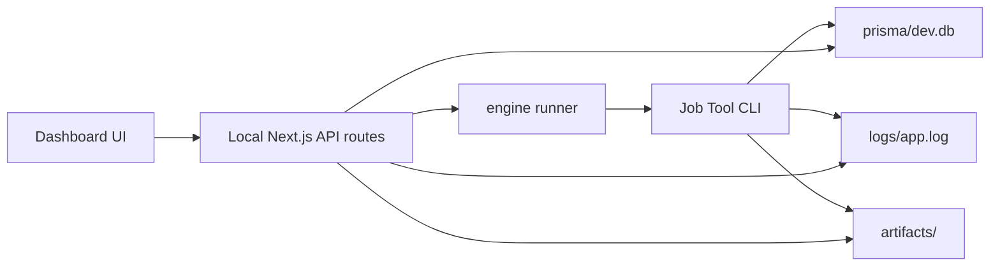

# 🎛️ Job Tool Dashboard

> A local Next.js command center for the Job Tool engine.

[](https://nextjs.org/)
[](https://react.dev/)
[](https://sqlite.org/)
[](./LICENSE)

Job Tool Dashboard turns the local `Job Tool` engine workspace into a readable, searchable, and controllable UI. It shows recommendations, review history, decisions, answers, artifacts, companies, logs, and live run progress without moving your personal job data into a hosted service.

## ✨ What It Shows

| Page | Purpose |
| --- | --- |
| `/` | Active run, readiness blockers, incomplete applications, operational highlights, and quick actions. |
| `/run` | Start/stop engine runs, view live progress, inspect current job activity, and copy CLI fallback scripts. |
| `/recommendations` | Explore-mode recommendations with score, decision, and policy context. |
| `/reviews` | Job review history from `JobReviewHistory`. |
| `/decisions` | Detailed application decisions and reason trails. |
| `/answers` | Prepared answer sets and reusable answer memory. |
| `/artifacts` | Batch reports, external apply reports, screenshots, and run diagnostics. |
| `/companies` | Company-level aggregates, logos, LinkedIn URLs, and review counts. |
| `/search` | Cross-collection search across stored engine data. |

## 🔗 How It Connects To The Engine

The dashboard is a separate project, but it binds to the engine through `ENGINE_ROOT`.

```text
Desktop/
  Job Tool/             # engine data lives here
  Job Tool Dashboard/   # dashboard reads and controls the engine
```

```env
ENGINE_ROOT=../Job Tool
```

If `ENGINE_ROOT` is missing, the dashboard falls back to a sibling `../Job Tool` folder.



The server binds to `127.0.0.1`, rejects non-loopback hosts, and protects mutating API requests with same-origin checks. The dashboard reads:

- `prisma/dev.db`
- `logs/app.log`
- `artifacts/*`
- `.env`
- LinkedIn session readiness (without exposing session contents)
- `user/resume.pdf`

## ▶️ Run Control

The `/run` page can start engine commands from the dashboard and follow their output through the database, logs, and artifacts the engine already writes.

Current controls include:

- command-aware readiness checks for engine folder, database, logs, resume, LinkedIn session, and the configured LLM provider
- `Start Run` for configured engine commands
- `Stop` using Windows process-tree termination when needed
- live refresh while a run is active
- current activity such as scanning, evaluating, applying, submitted, failed
- latest job outcomes with role, company, score, decision, and summary
- generated PowerShell fallback scripts for manual runs

The `DRY Run` toggle is the live-application control. It defaults to enabled when a request omits the value; turning it off is the explicit instruction to allow a live apply. No second confirmation dialog is required.

The dashboard intentionally hides raw PID details from the main UI because process IDs are not useful for normal run monitoring.

## ⚡ Quick Start

```bash
npm install
cp .env.example .env
npm run dev
```

Open:

```text
http://localhost:3000
```

If port `3000` is busy, run Next on another port:

```bash
npm run dev -- -p 3100
```

## 🔧 Environment

Minimal `.env`:

```env
ENGINE_ROOT=../Job Tool
```

Use an absolute path if the projects are not siblings:

```env
ENGINE_ROOT=C:\Users\you\Desktop\Job Tool
```

## 🧪 Scripts

```bash
npm run dev          # start local dashboard
npm run build        # production build
npm run start        # start production server after build
npm run type-check   # Next build/type validation
npm test             # Vitest suite
```

## 🧩 Local API Surface

| Route | Purpose |
| --- | --- |
| `GET /api/config/status` | Local readiness and configuration checks. |
| `POST /api/run/start` | Start a dashboard-configured engine run. |
| `POST /api/run/stop` | Stop the active engine run. |
| `GET /api/run/current` | Return active run state and computed progress. |
| `GET /api/run/:id/events` | Server-sent events for run updates. |

## 🛡️ Local Security Boundary

- Run payloads accept only known commands and fields, bounded numeric values, public HTTPS job/provider URLs, and engine-contained regular file paths.
- Artifact detail reads enforce category/name containment, reject symlinks and oversized JSON, and recursively redact secrets.
- API responses use `no-store`; run start/stop routes require a loopback host and matching origin.
- CSP and baseline browser security headers are set by Next.js.

## ✅ Verification

```bash
npm run type-check
npm test
```

The test suite covers data readers, artifact parsing, run configuration, run control, and major dashboard sections.

## 📚 Documentation

- [docs/README.md](./docs/README.md): documentation entrypoint
- [docs/FILE_MAP.md](./docs/FILE_MAP.md): page, component, data reader, API, and test map

## 📄 License

Source-available under the [PolyForm Noncommercial 1.0.0](./LICENSE) license. Personal and non-commercial use are allowed. Commercial use requires separate permission.
