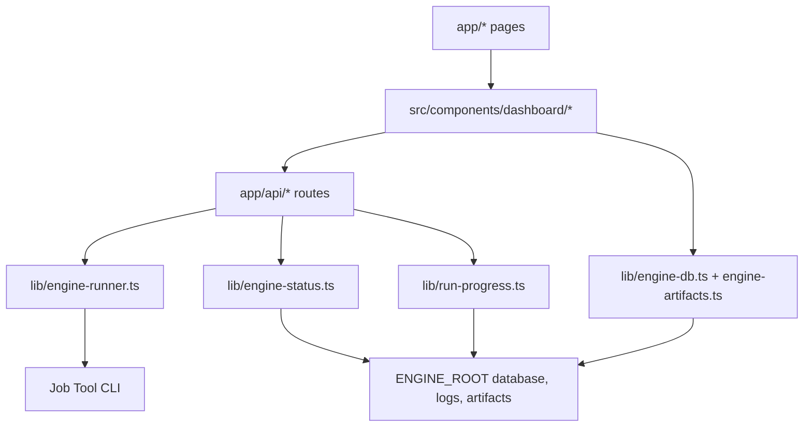

# 📚 Job Tool Dashboard Documentation

This folder explains how the dashboard is organized and how it connects to the Job Tool engine. It is meant to be useful from GitHub as well as during local development.

## 🧭 Start Here

| Document | Purpose |
| --- | --- |
| [FILE_MAP.md](./FILE_MAP.md) | Map pages, API routes, components, data readers, and tests. |
| [../README.md](../README.md) | Public overview, setup, run control, and API surface. |

## 🏗️ Architecture



## 💡 Key Ideas

| Concept | Explanation |
| --- | --- |
| Engine root | `ENGINE_ROOT` points the dashboard at the sibling Job Tool workspace. |
| Read model | Most pages read SQLite, logs, and artifacts directly from the engine. |
| Run control | `/run` starts and stops engine commands through local Next.js API routes. |
| Progress | Live progress is inferred from fresh DB rows plus structured engine logs. |
| Fallback scripts | The UI still generates PowerShell wrappers for manual execution. |
| Local only | The dashboard is designed for local development and personal workflow control. |

## 🧪 Development Loop

```bash
npm run dev
npm run type-check
npm test
```

Do not leave hidden dashboard servers running after verification. If a server is started in the background, record the PID and stop it before finishing.

## 🛠️ When You Change...

| Change | Files to check |
| --- | --- |
| A dashboard page | `app/<page>/page.tsx`, matching component under `src/components/dashboard/`, component test |
| Engine data reads | `lib/engine-db.ts`, `lib/engine-artifacts.ts`, `lib/run-progress.ts`, lib tests |
| Run controls | `src/components/dashboard/run-script-builder.tsx`, `app/api/run/*`, `lib/engine-runner.ts`, run tests |
| Preflight checks | `lib/engine-status.ts`, `app/api/config/status/route.ts`, status tests |
| CLI command options | `lib/run-config.ts`, run config tests, README |

## ✅ Maintenance Rules

- Keep [FILE_MAP.md](./FILE_MAP.md) aligned with new routes, components, and tests.
- Keep [../README.md](../README.md) accurate for GitHub visitors.
- Prefer user-facing state over internal implementation details in the UI.
- Avoid raw PID-centric UX unless debugging specifically requires it.
